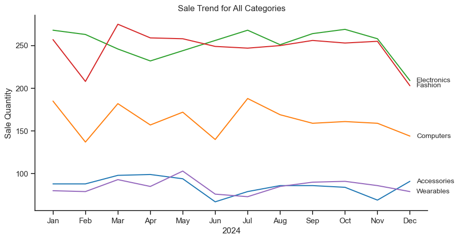
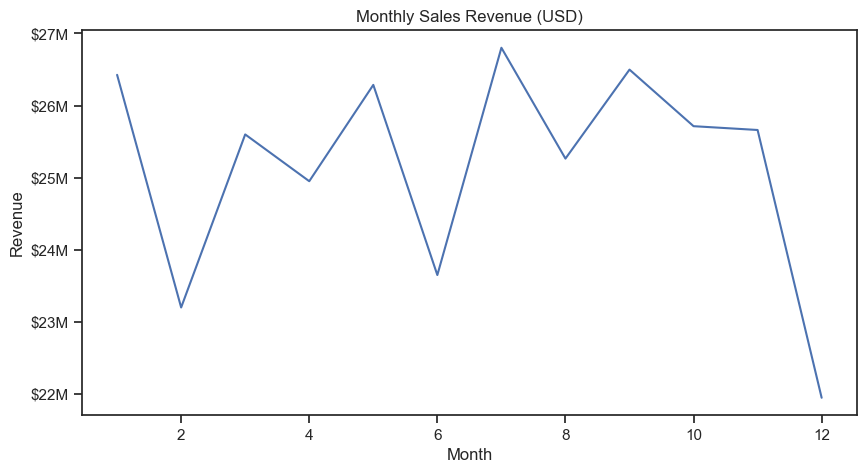
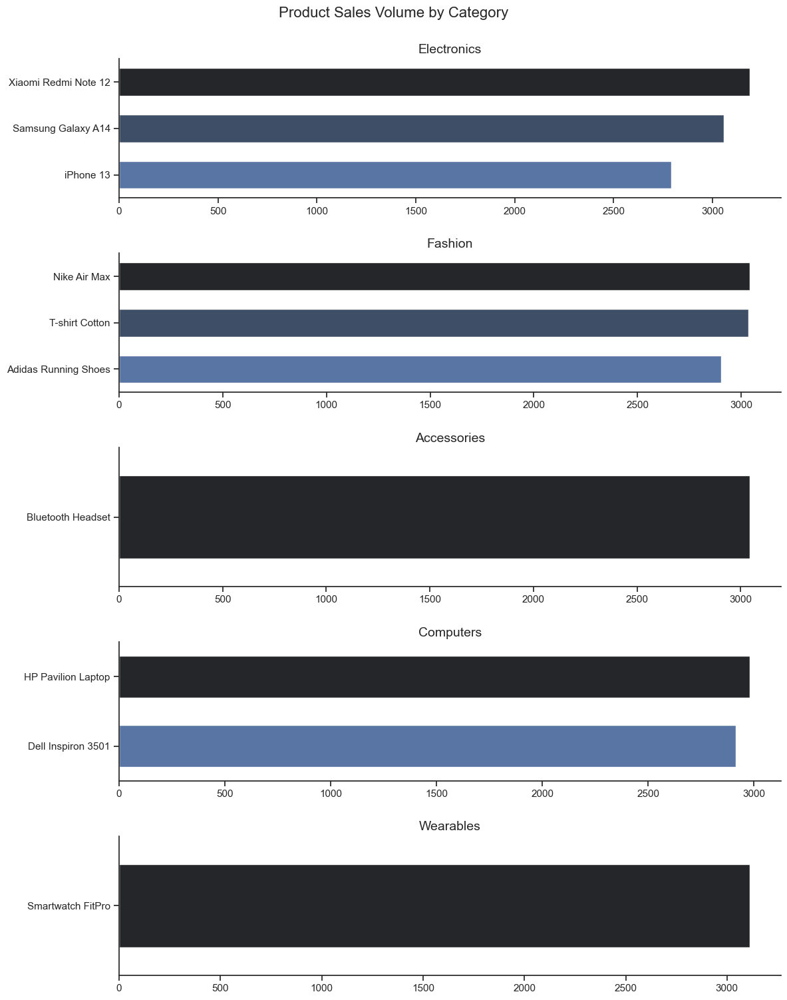
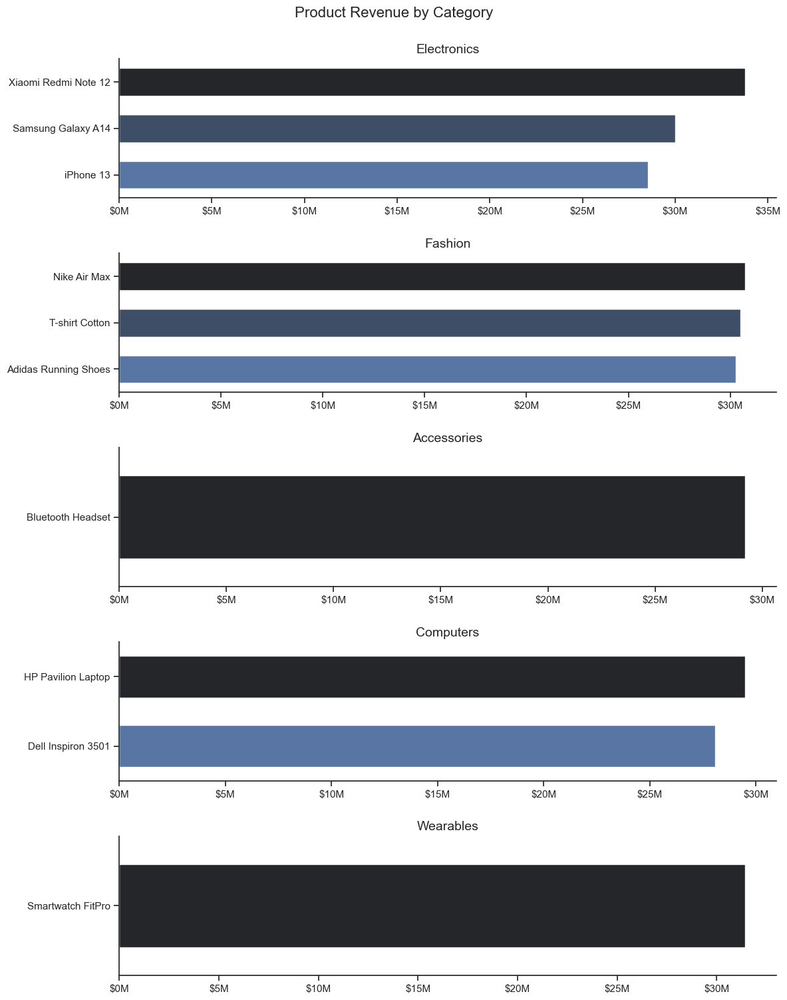
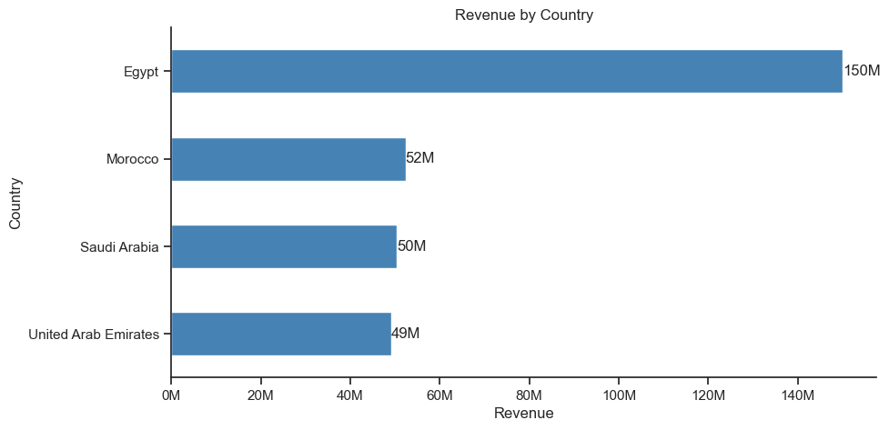
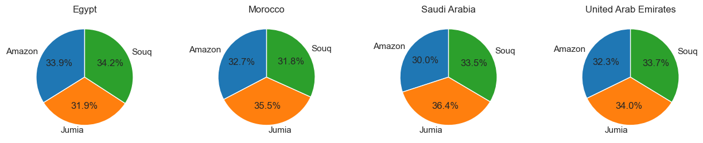

## Monthly Sales Performance: Category Distribution & Revenue Trend
This section analyzes monthly sales performance from two perspectives:

Category-level distribution – to understand how product categories behave over time.
Revenue trend (USD) – to identify seasonality and overall business performance.

Values are aggregated by month and visualized to highlight seasonal patterns, category dominance, and revenue fluctuations across 2024.


```js
sns.lineplot(data=df_pivot,dashes=False, palette='tab10')
sns.set_theme(style='ticks')
sns.despine()
plt.title('Sale Trend for All Categories')
plt.xlabel('2024')
plt.ylabel('Sale Quantity')
plt.legend().remove()


for i in range(5):
    plt.text(11.2, df_pivot.iloc[-1, i], df_pivot.columns[i], va='center', fontsize=10)
plt.show()
```
**Results**

```js
import matplotlib.ticker as mtick

ax = sns.lineplot(data=data, x='month_no', y='TotalAmount')

ax.yaxis.set_major_formatter(
    mtick.FuncFormatter(lambda x, pos: f'${x/1e6:.0f}M')
)

plt.title('Monthly Sales Revenue (USD)')
plt.xlabel('Month')
plt.ylabel('Revenue')
plt.show()
```

### Outcome

Low months (Feb, June, Dec) → Fix demand drop
1. Run targeted promotions:
    - “Mid-season discounts” in February
    - “Summer survival deals” in June (very important for Gulf countries)
    - “Year-end clearance” in December
    - Bundle offers
“Buy more, save more”, product bundles (A + B discount). Increases basket size during weak months

High season (May, July) → Maximize profit
1. Increase pricing slightly (smart pricing)
    - During peak demand, reduce discount dependency
2. Scale inventory & logistics
    - Avoid stockouts
    - Faster delivery options

## Product Sale Volume
This section explores product-level sales performance across different categories.
The analysis focuses on identifying products based on total quantity and revenue sold within each category.
By comparing product sales volumes or revenue we can better understand customer preferences, category dominance, and high-performing products in the overall portfolio.

```js
fig, ax = plt.subplots(len(category_list), 1, figsize=(12, 15))

sns.set_theme(style='ticks')

for i, category in enumerate(category_list):

    # TOP 5 products
    data = (
        df[df['Category'] == category]
        .groupby('Product')['Quantity']
        .sum()
        .sort_values(ascending=False)
        .head(5)
        .reset_index()
    )

    # wykres
    sns.barplot(
        data=data,
        x='Quantity',
        y='Product',
        ax=ax[i],
        palette='dark:b',
        width=0.6,
        hue='Product'
    )

    ax[i].set_title(f'{category}', fontsize=14)

    ax[i].set_xlabel('')
    ax[i].set_ylabel('')
fig.suptitle('Product Sales Volume by Category',fontsize=16,y=1)

sns.despine()
plt.tight_layout(h_pad=2)
plt.show()
```


**Results**




The visualization highlights the top-selling products within each category based on quantity sold. Electronics and Fashion displayed the strongest product diversity, while categories such as Wearables and Accessories were dominated by single high-performing products. Affordable consumer electronics and lifestyle products generated the highest sales volumes overall.

The second visualization, focused on product revenue, largely confirms the patterns observed in the sales volume analysis. Products with high sales quantities also generated the strongest overall revenue, indicating consistent consumer demand across key categories.

However, an important business insight can be observed in the Fashion category. Although Adidas Running Shoes recorded a lower sales volume than T-shirt Cotton and Nike Air Max, it generated a similar level of revenue. This suggests that the product has a higher average selling price and stronger profit potential per unit sold.

From a business perspective, this indicates that premium or higher-margin products can contribute significantly to total revenue even with lower transaction volumes. It also highlights the importance of balancing high-volume products with high-value products in order to optimize both revenue generation and profitability.

## Revenue By Country 
This section focuses on analyzing total revenue distribution across countries to identify the strongest-performing markets in the dataset. A horizontal bar chart was used to improve readability and clearly compare revenue levels between regions.

Revenue values were converted into millions for better interpretability, and data visualization was enhanced using Seaborn styling, value annotations, and axis formatting.
```js
import matplotlib.ticker as mtick

country_sales = df.groupby('Country')['TotalAmount'].sum().sort_values(ascending=True)

ax = country_sales.plot(kind='barh', color='steelblue')

# format osi X w milionach
ax.xaxis.set_major_formatter(mtick.FuncFormatter(lambda x, _: f'{x/1_000_000:.0f}M'))

# wartości na końcu słupków
for i, v in enumerate(country_sales):
    ax.text(v, i, f'{v/1_000_000:.0f}M', va='center')

plt.title("Revenue by Country")
plt.xlabel("Revenue")
plt.ylabel("Country")
sns.despine()
plt.show()
```
**Results**


The analysis shows a highly concentrated revenue distribution among a few key countries:

Egypt is the dominant market, generating approximately 150M, significantly outperforming all other countries.
Morocco ranks second with around 52M in total revenue.
Saudi Arabia closely follows with about 50M.
United Arab Emirates contributes roughly 49M, making it the fourth strongest market.

The results clearly indicate that revenue is heavily concentrated in Egypt, which generates almost three times more revenue than the next best-performing countries. Meanwhile, Morocco, Saudi Arabia, and the United Arab Emirates show very similar performance levels, suggesting a competitive mid-tier market group.

This distribution highlights Egypt as the primary strategic market, while the other three countries represent stable but significantly smaller revenue contributors.

Overall, the analysis suggests a strong geographical imbalance in sales performance, which could be further explored to understand the drivers behind Egypt’s dominance and opportunities for growth in other regions.

## Platform Preference Analysis Across Countries

This section examines how different e-commerce platforms perform within each country by analyzing their share of total quantity sold. The goal is to identify regional preferences and understand how platform popularity varies across markets.

Four pie charts were used to compare platform distribution in Egypt, Morocco, Saudi Arabia, and the United Arab Emirates.
```js
countries = ['Egypt', 'Morocco', 'Saudi Arabia', 'United Arab Emirates']

fig, ax = plt.subplots(1, 4, figsize=(15, 5))

plt.subplots_adjust(wspace=0.5)

for i, country in enumerate(countries):
    data = df[df['Country'] == country].groupby('Platform')['Quantity'].sum()

    ax[i].pie(
        data,
        labels=data.index,
        autopct='%1.1f%%',
        startangle=90,
        colors=sns.color_palette('tab10')
    )

    ax[i].set_title(country)

plt.show()
```
**Results**

The analysis reveals clear but subtle differences in platform dominance across countries:

In Egypt, Souq is the most popular platform, accounting for approximately 34.2% of total sales volume. This makes it the leading platform in the Egyptian market.
In Morocco, Saudi Arabia, and the United Arab Emirates, Jumia is the dominant platform, holding the highest share in each country, ranging between 34.6% and 36%.
Amazon consistently shows the lowest share across all four countries, with values ranging between 30% and 33%, indicating slightly weaker performance compared to its competitors in this dataset.

The results highlight a regionally differentiated platform preference pattern. While Egypt shows stronger performance for Souq, the other three countries are clearly led by Jumia, suggesting stronger market penetration in those regions.

Amazon, despite being globally strong, appears to have a relatively lower share across all analyzed markets, indicating potential opportunities for growth or stronger competition from regional platforms.

Overall, the market is competitive but slightly fragmented, with no single platform fully dominating across all countries.