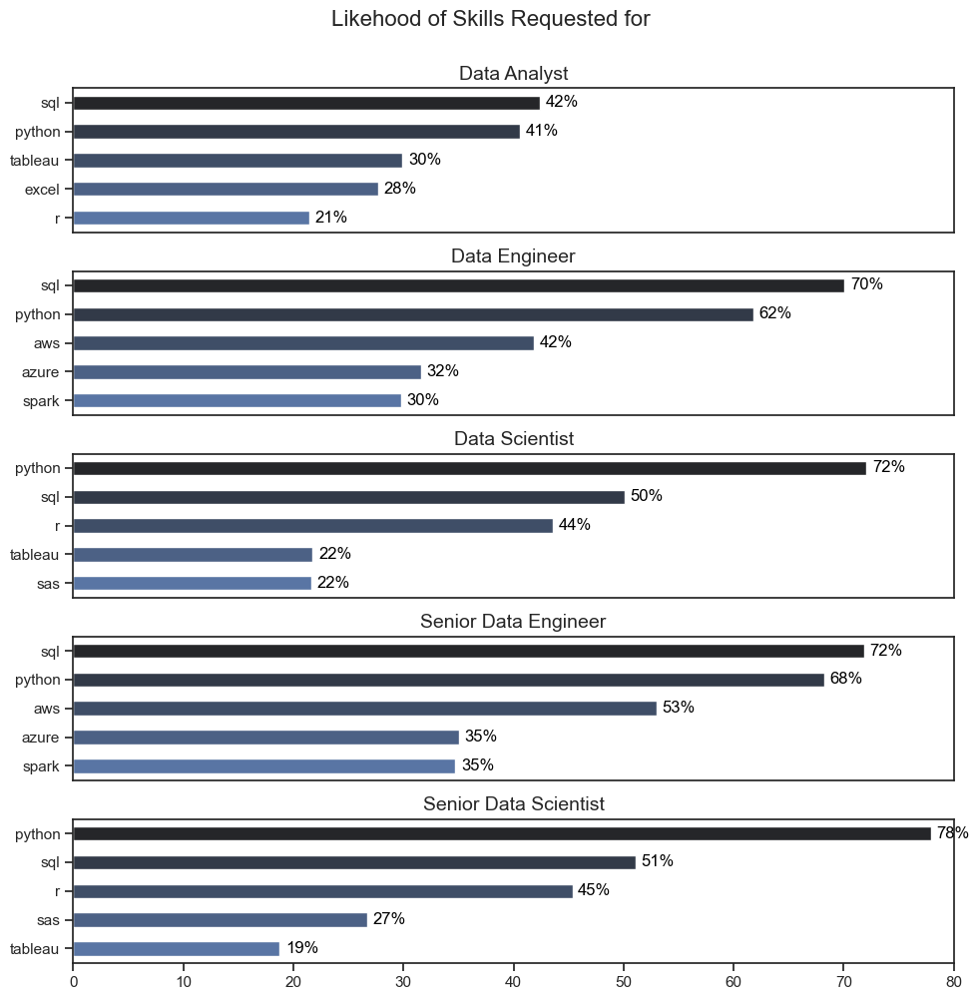
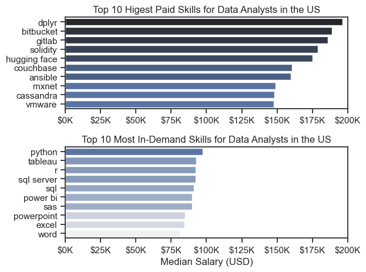

## Overview
---
Welcome to my analysis of the data job market, focusing on data analyst roles. This project was created out of a desire to navigate and understand the job market more effectively. It delves into the top-paying and in-demand skills to help find optimal job opportunities for data analyst.

The data sourced from Luke Barousse's Python Course which provides a foundation for my analysis, cotaining detailed information on job titles, salaries, locations, and essential skills.Through a series of Python scriptts, I explore key questions such as the most demanded skills, salary trends, and the intersection of demand and salary in data analytics.

## The Questions
---
### Below are the questions I want to answer in my project:
1. What are the skills most in demand for the top 5 most popular data roles?
2. How are in-demand skills trending for Data Analysts?
3. How well do jobs and skills pay for Data Analysts?
4. What are the optimal skills for data analysts to - learn? (High Demand and High Paying)

## Tools I Used
---
 For my deep dive into the data analyst job market, I harnessed the power of several key tools:
- **Python** : The backbone of my analysis, allowing me to analyze the data and find critical insights.
  - Pandas Library:The Python library used to analyze the data.
  - Matplotlib Library:The library I used to visualize my data.
  - Seaborn Library:The library I used to create more advanced visuals.

- **Jupiter Notebooks**: The tool I used to run my Phyton scripts which let me easily include my notes and analysis.
- **Visual Studio Code**: My go-to for executing my Phyton scripts.
- **Git & GitHub**: Essential for version control and sharing my Phyton code and analysis, ensuring collaboration

## Data Preparation and Cleanup
---
This section outlines the steps taken to prepare the data for analysis, ensuring accuracy and usability.

## Import & Clean Up Data
To prepare the analysis environment, several Python libraries were imported for data handling, visualization, and dataset loading. pandas was used for data manipulation, while matplotlib and seaborn were included for data visualization. The datasets library was used to load the dataset directly, and ast was used to safely convert string representations of lists into actual Python list objects.

The dataset was loaded from the lukebarousse/data_jobs source and converted into a Pandas DataFrame for easier analysis. Basic data cleaning steps were then applied to improve data usability. The job_posted_date column was converted into a datetime format to support time-based analysis, and the job_skills column was transformed from string format into proper Python lists for easier skill extraction and processing.
```js
#Importing Libraries
import ast
import pandas as pd
import matplotlib.pyplot as plt
import seaborn as sns
from datasets import load_dataset

#Loading the dataset
dataset=load_dataset('lukebarousse/data_jobs')
df=dataset['train'].to_pandas()

#Data Cleaning
df['job_posted_date']=pd.to_datetime(df['job_posted_date'])
df['job_skills']=df['job_skills'].apply(lambda x: ast.literal_eval(x) if pd.notna(x) else x)
```

## The Analysis
Each jupiter notebook for this project aimed at investigating specific aspects of the data job market. Here's how I approached each question:

## 1. What are the skills most in demand for the top 5 most popular data roles?
---
To find the most demanded skills for the top 5 most popular data roles. I filtered out those positions by which ones were the most popular, and got the top 5 skills for these top 3 roles. This query highlights the most popular job titles and their top skills, showing which skills pay attention to depending on the role I'm targeting.

View my netobook with detailed steps here:[2_Skills_Count](2_Skills_Count.jypnb)

### Visualize Data

```js 
fig, ax=plt.subplots(len(job_titles),1, figsize=(10,10))
sns.set_theme(style='ticks')

for i, job_title in enumerate(job_titles):
    data=df_skills_percentage[df_skills_percentage['job_title_short']==job_title].head(5)
    sns.barplot(x='skill_percentage', y='job_skills', data=data, ax=ax[i],hue='job_skills', palette='dark:b',width=0.5)
    ax[i].set_title(f'{job_title}',fontsize=14)
    ax[i].set_xlabel('')
    ax[i].set_ylabel('')
    ax[i].set_xlim(0,80)

    for n,v in enumerate(data['skill_percentage']):
        ax[i].text(v+0.5, n, f'{v:.0f}%', color='black', va='center')
    if i != len(job_titles)-1:
        ax[i].set_xticks([])
fig.suptitle('Likehood of Skills Requested for',fontsize=16,y=1)

plt.tight_layout(h_pad=1)
plt.show() 
```

**Results**



## Outcome
- SQL is the most requested skill for Data Analysts and Data Engineers, with it in over half the job posting for both roles. For Data Scientist, Python is the most sought-after skill, appearing in 72% of job postings.
- Data Engineers require more speciaized technical skills (AWS, Azure, Spark) compared to Data Analysts and Data Scientists who are expected to be proficient in more general daata management and analysis tools (Excel, Tableau)
- Python is a versatile skill, highly demanded across all five roles, but mostly prominently for Senior Data Scientist (78%) and Data Engineers (65%)

## 2. How are in-demand skills trending for Data Analysts?

**Visualize Data**
```js
df_plot=df_DA_percent.iloc[:,:5]
sns.lineplot(data=df_plot,dashes=False, palette='tab10')
sns.set_theme(style='ticks')
sns.despine()
plt.title('Top 5 Skills Trend for Data Analyst Jobs')
plt.xlabel('2023')
plt.ylabel('Percentage of Job Postings')
plt.legend().remove()

ax=plt.gca()
ax.yaxis.set_major_formatter(plt.FuncFormatter(lambda x, _: f'{x:.0f}%'))

for i in range(5):
    plt.text(11.2, df_plot.iloc[-1, i], df_plot.columns[i], va='center')
plt.show()
```

**Results**


### Insights:
- SQL and Python show the highest demand percentages, fluctuating between 50-70% and 40-50% respectively. 
- Excel, Tableau, and Power BI remain more stable at lower percentages between 20-40%. 
- SQL maintains consistent high demand, Python shows growth and slight volatility, while other tools display relatively stable demand patterns.

## 3. How well do jobs and skills pay for Data Analysts?

### Salary Analysis for Data Nerds

**Visualize Data**

```js
sns.boxplot(data=df_US_top6,x='salary_year_avg',y='job_title_short',order=order,orient='h',palette='Blues',hue='job_title_short')
sns.set_theme(style='ticks')

plt.title('Salary Distribution by Job Title in the United States')
plt.xlabel('Average Yearly Salary (USD)')
ax=plt.gca()
plt.ylabel('')
ax.xaxis.set_major_formatter(plt.FuncFormatter(lambda x, post: f'${int(x/1000)}K'))
plt.xlim(0,400000)
plt.show()
```

**Results**


**Insights**
- There is a significant variation in salary ranges across different job titles. Senior Data Scientist positions tend to have the highest salary potential, indicating the high value placed on advanced data skills and experience in the industry.
- Senior Data Engineer and Senior Data Scientist roles show a considerable number of outliers on the higher end of the salary spectrum, suggesting that exeptional skills or circumstances can lead to high pay in these roles. In contrast, Data Analyst roles demonstrate more consistency in salary, with fewer outliners.
- The median salaries increase with the seniority and specialization of the roles. Senior roles not only have higher median salaries, but also larger differences in typical salaries, reflecting greater variance in compensation as responsibilities increase.

### Highest Paid vs Most Demand Skills for Data Analysts

```js
fig, ax=plt.subplots(2,1)
#df_DA_top_pay['median'].plot(kind='barh',ax=ax[0],title='Top 10 Skills by Median Salary',legend=False)
sns.barplot(data=df_DA_top_pay,x=df_DA_top_pay['median'],y=df_DA_top_pay.index,ax=ax[0],hue='median',palette='dark:b_r')
sns.set_theme(style='ticks')
#ax[0].invert_yaxis()
ax[0].legend_.remove()
ax[0].set_xlim(0,200000)
ax[0].set_xlabel('')
ax[0].set_ylabel('')
ax[0].set_title('Top 10 Higest Paid Skills for Data Analysts in the US')
ax[0].xaxis.set_major_formatter(plt.FuncFormatter(lambda x, _: f'${int(x/1000)}K'))
#df_DA_top_skills['median'].plot(kind='barh',ax=ax[1],title='Top 10 Skills by Count',legend=False)
sns.barplot(data=df_DA_top_skills,x=df_DA_top_skills['median'],y=df_DA_top_skills.index,ax=ax[1],hue='median',palette='light:b')
ax[1].legend_.remove()
ax[1].set_title('Top 10 Most In-Demand Skills for Data Analysts in the US')
ax[1].set_xlim(0,200000)
ax[1].invert_yaxis()
ax[1].set_ylabel('')
ax[1].xaxis.set_major_formatter(plt.FuncFormatter(lambda x, _: f'${int(x/1000)}K'))
ax[1].set_xlabel('Median Salary (USD)')
plt.tight_layout()
plt.show()
```

**Results**



**Insights**

- The top graph shows specialized technical skills like 'dplyr', 'Bitbucket','Gitlab' are associated with higher salaries, some reaching up to $200K, suggesting that advanced technical proficiency can increase earning potential.

- The bottom graph highlights that fundational skills like 'Excel', 'PowerPoint', 'SQL' are the most in-demand, even though they may not offeer the highest salaries. This demostrate the importance of these core skills for emplyability in data analysis roles.

- There is a clear distinction between the skills that are highest paid and those that are most in-demand. Data Analysts aiming to maximize their career potential should consider developing a diverse skill set that includes both high-paying specialized skills and widely demanded foundational skills.

## 4. What is the most optimal skill to learn for Data Analysts?

```js
fig, ax = plt.subplots()
#df_plot.plot(kind='scatter',x='skill_percent',y='median_salary',ax=ax,figsize=(10,6))
sns.scatterplot(data=df_plot, x='skill_percent', y='median_salary', hue='technology', palette='Set2', s=100, ax=ax)
sns.despine()
texts = []
for i,txt in enumerate(df_DA_skills_high_demand.index):
    texts.append(plt.text(df_DA_skills_high_demand['skill_percent'][i], df_DA_skills_high_demand['median_salary'][i], txt))

adjust_text(texts, arrowprops=dict(arrowstyle='->', color='gray'), fontsize=10)
ax=plt.gca()
ax.yaxis.set_major_formatter(plt.FuncFormatter(lambda x, p: f'${int(x/1000)}K'))
ax.xaxis.set_major_formatter(plt.FuncFormatter(lambda x, _: f'{x:.0f}%'))
plt.title('Most Optimal Skills for Data Analysts in the US', fontsize=16)
plt.xlabel('Percentage of Job Postings', fontsize=12)
plt.ylabel('Median Salary', fontsize=12)
plt.tight_layout()
plt.show()
```

**Result**


**Insights**

- The scatter plot shows that most of the 'programming' skills tend to cluster at higher salary levels compared to other categories, indicating that programming exertise might offer greater salary benefits within the data analytics field.

- Analyst tools, including Tableau and Power BI, are prevalent in job postings and offer competitive salaries, showing that visualization and data analysis software are crucial for current data roles. This category not onky has good salaries, but is also versatile across different types of data tasks.

- The database skills such as Oracle and SQL Server, are associated with some of the highest salaries among data analyst tools. This indicated a significant demand and valuation for data management and manioulation expertise in the industry.