# Exploratory Data Analysis (EDA)
This dataset contains 2,000 customer and order records from a simulated e-commerce platform. It includes demographic information, purchasing behavior, subscription status, product categories, and transactional data.

I used this dataset to improve my Python skills and broaden my experience in data analysis, including data cleaning, visualization, exploratory analysis, and deriving business insights from real-world-style e-commerce data.

## Import & Clean Up Data
To prepare the analysis environment, several Python libraries were imported for data handling, visualization, and dataset loading. pandas was used for data manipulation, while matplotlib and seaborn were included for data visualization. The datasets library was used to load the dataset directly, and ast was used to safely convert string representations of lists into actual Python list objects.

The dataset was loaded from the (https://www.kaggle.com/datasets/deepeshkansotia/food-delivery-operations-and-customer-analytics/data) source and converted into a Pandas DataFrame for easier analysis. Basic data cleaning steps were then applied to improve data usability. The signup_date, last_purhcase_date, order_date columns were converted into a datetime format to support time-based analysis. To improve the quality of the analysis and generate more meaningful business insights, total_value and days_since_last_purchase additional features were created during the data preparation stage. These engineered features provided deeper insights into customer activity and purchasing patterns throughout the EDA process.

1. Import Libraries
```js
import pandas as pd
import numpy as np
import matplotlib.pyplot as plt
import seaborn as sns
sns.set(style="whitegrid")
plt.rcParams["figure.figsize"] = (10, 5)
```

2. Load Dataset
```js
df = pd.read_csv("data.csv")
df.head()
```

3. Convert Date Columns
```js
df["signup_date"] = pd.to_datetime(df["signup_date"])
df["last_purchase_date"] = pd.to_datetime(df["last_purchase_date"])
df["order_date"] = pd.to_datetime(df["order_date"])
```

4. Feature Engineering
```js
df["total_value"] = df["unit_price"] * df["quantity"]

df["days_since_last_purchase"] = (
    df["order_date"].max() - df["last_purchase_date"]
).dt.days
```

## Analysis

1. Age Distribution
```js
sns.histplot(df["age"], bins=20, kde=True)
plt.title("Age Distribution")
plt.show()
```
**Results**
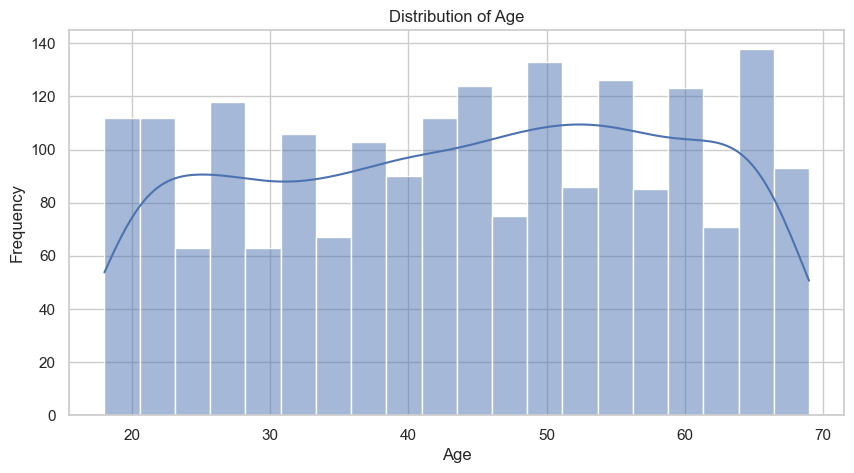
2. Unit Price Distribution
```js
sns.histplot(df["unit_price"], bins=30, kde=True)
plt.title("Unit Price Distribution")
plt.show()
```
**Results**
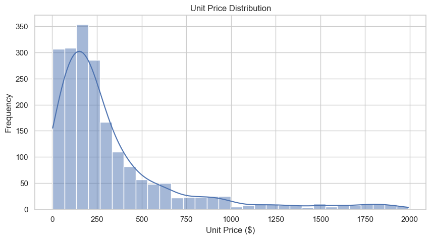
3. Quantity Distribution
```js
sns.histplot(df["quantity"], bins=20)
plt.title("Quantity Distribution")
plt.show()
```
**Results**
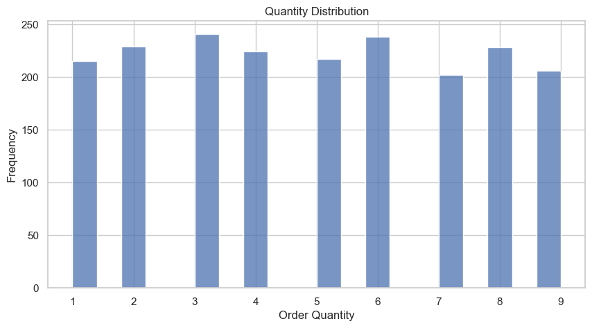


4. Top Countries by Orders
```js
top_countries = df["country"].value_counts().head(10)

sns.barplot(x=top_countries.values, y=top_countries.index)
plt.title("Top 10 Countries by Orders")
plt.show()
```
**Results**
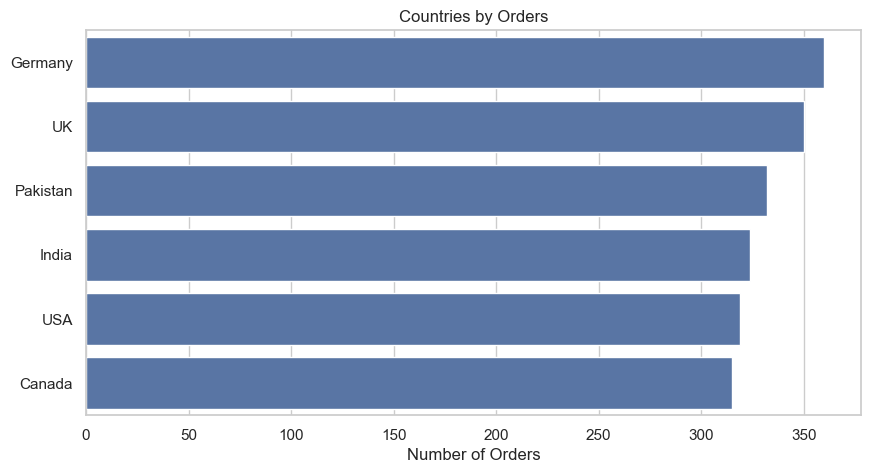

### Outcome
Highest active users:
Germany, UK, USA
**This suggests:**
Strong customer retention in these markets.
These countries may have stronger purchasing power or better product-market fit.

5. Gender vs Average Spending
```js
gender_spending = df.groupby("gender")["total_value"].mean().sort_values()

sns.barplot(x=gender_spending.index, y=gender_spending.values)
plt.title("Average Spending by Gender")
plt.show()
```
**Results**
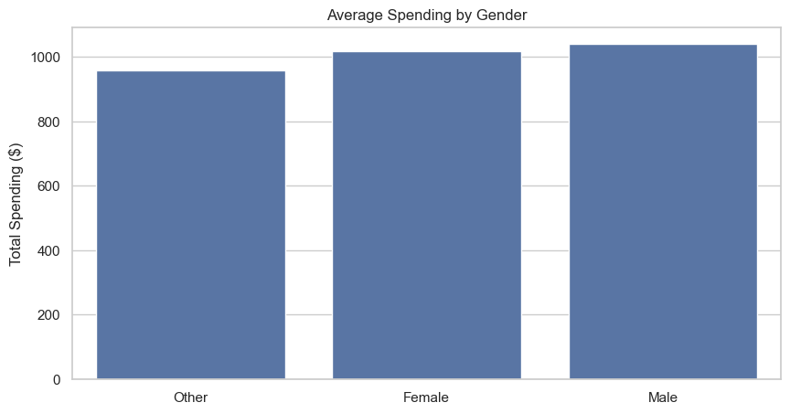

6. Top Categories
```js
top_categories = df["category"].value_counts()

sns.barplot(x=top_categories.values, y=top_categories.index)
plt.title("Top Product Categories")
plt.show()
```
**Results**

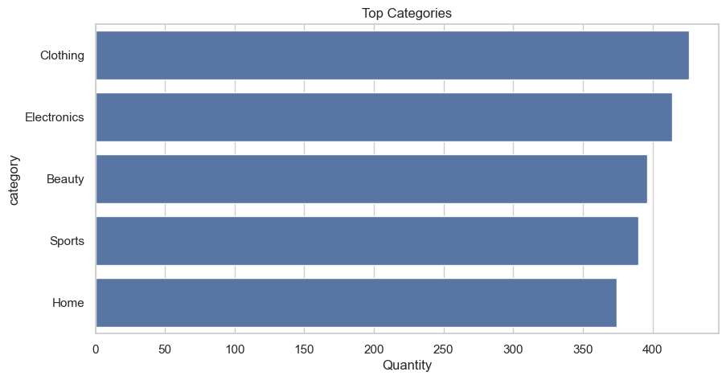

7. Top Products
```js
top_products = df["product_name"].value_counts().head(10)

sns.barplot(x=top_products.values, y=top_products.index)
plt.title("Top 10 Products")
plt.show()
```
**Results**
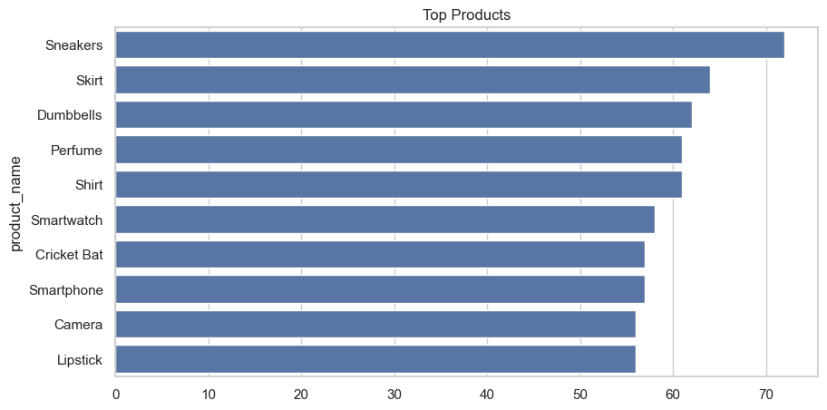


8. Subscription Status Distribution
```js
df["subscription_status"].value_counts().plot(kind="bar")
plt.title("Subscription Status Distribution")
plt.show()
```
**Results**
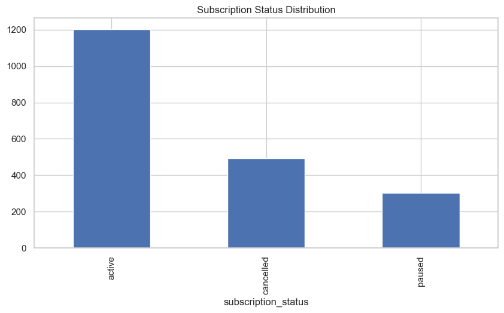


9. Subscription Status by Country
```js
ct = pd.crosstab(df["country"], df["subscription_status"])

ct.plot(kind="bar", stacked=True, figsize=(12,6))
plt.title("Subscription Status by Country")
plt.show()
```
**Results**
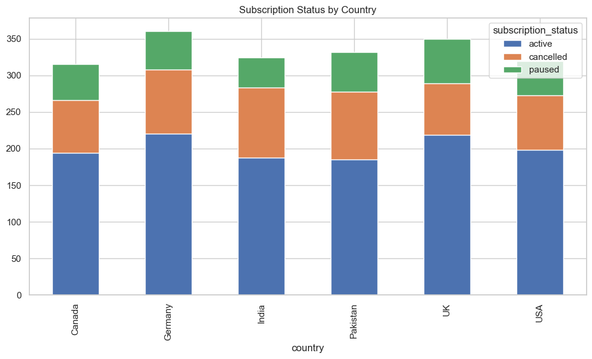
### Outcome
- Higher cancellations appear in:
India, Germany
Possible causes:
Pricing issues, Delivery/service quality, Subscription value mismatch
- Paused Subscriptions
Paused users are relatively stable across countries.
**Interpretation:*
Some customers are interested but temporarily inactive.
Retargeting campaigns could reactivate them.
**Suggested actions:*
discount offers, email reminders, loyalty rewards
10. Time Series Analysis
```js
Orders Over Time
orders_time = df.groupby(df["order_date"].dt.date).size()

orders_time.plot()
plt.title("Orders Over Time")
plt.show()
```
**Results**
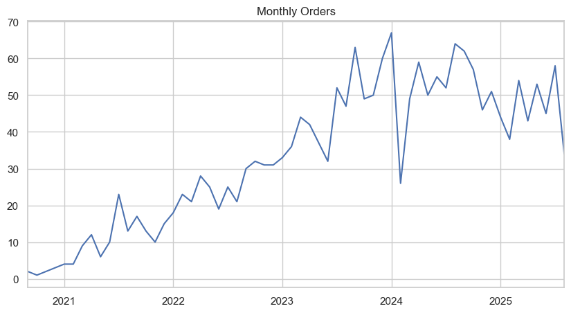
### Outcome
Low order volume in early years
Strong increase from 2023 onward
Peak activity around 2024–2025
- *Interpretation:*
The business is growing over time.
Marketing/customer acquisition likely improved.
However:
The graph is noisy with spikes.
Possible reasons:
promotions
seasonal campaigns
holidays
flash sales
Important Business Insight
Growth appears inconsistent rather than smooth.
- *Recommendation:*
Analyze:
monthly sales trends
seasonal decomposition
holiday effects
campaign ROI

11. Signups Over Time
```js
signups = df.groupby(df["signup_date"].dt.date).size()

signups.plot()
plt.title("Signups Over Time")
plt.show()
```
**Results**
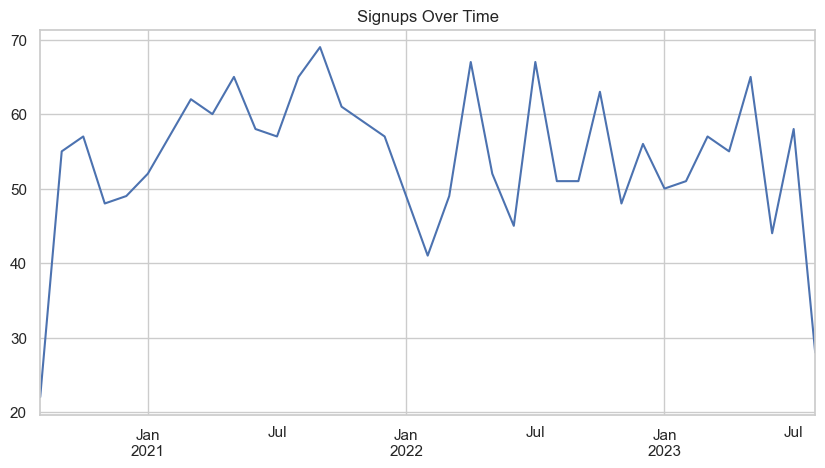
### Outcome
Observations
Signups remain fairly steady.
Some spikes occur around:
mid-2021
early-2022
mid-2023
- *Interpretation:*
--Acquisition campaigns occasionally worked well.
--Growth is stable but not exponential.
- *Comparing signups with orders:*
Orders are growing faster than signups.
Existing customers are purchasing more often.
Customer retention is improving.
That is usually a strong positive signal.
12. Correlation Analysis
```js
corr = df[
    ["age", "unit_price", "quantity",
     "purchase_frequency", "cancellations_count", "total_value"]
].corr()

sns.heatmap(corr, annot=True, cmap="coolwarm")
plt.title("Correlation Matrix")
plt.show()
```
**Results**
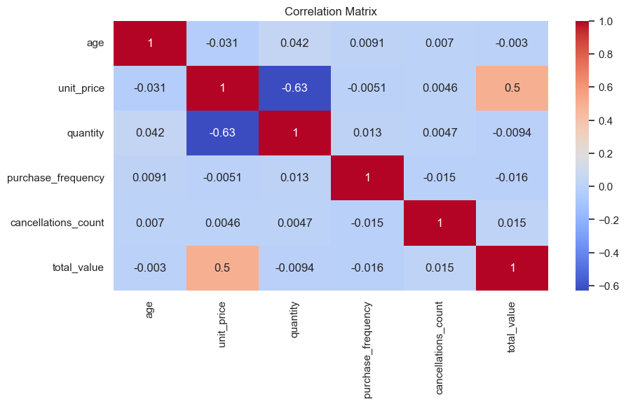

## Outcome
1. Key Insights
- Strong Negative Correlation
unit_price vs quantity = -0.63
This is the strongest relationship in the dataset.
**Interpretation:**
As product price increases, customers buy fewer units.
This is normal ecommerce price sensitivity behavior.
Lower-priced products likely drive bulk purchases.
High-priced items are bought less frequently.
- Moderate Positive Correlation
unit_price vs total_value = 0.50
**Interpretation:**
Higher-priced products contribute significantly to revenue.
Even though quantity decreases, revenue still rises because the price per item is high.
Premium products are important revenue drivers.
A balanced pricing strategy is useful.
- Weak/No Correlation
Most other values are close to 0:
age, purchase_frequency, ancellations_count

# Final Conclusions

This project provided valuable insights into customer behavior, purchasing patterns, subscription activity, and overall business performance within a simulated e-commerce environment.

The analysis suggests that the business is experiencing stable growth, with increasing order activity and strong engagement from existing customers. Countries such as the UK, USA, and Germany appear to be the strongest markets in terms of customer activity and sales performance.

At the same time, the analysis identified several areas that may require further attention, including customer cancellations, potential price sensitivity, and fluctuations in growth trends. These findings highlight the importance of customer retention strategies and deeper behavioral analysis.

Through this project, I strengthened my Python and data analysis skills by working with data cleaning, feature engineering, visualization, correlation analysis, and business insight generation using real-world-style e-commerce data.